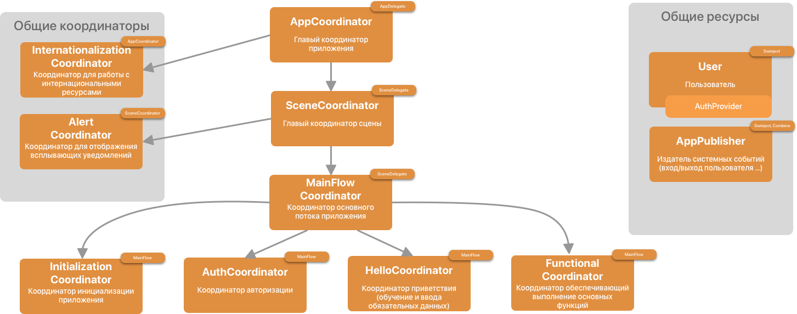

#  Swyzzy

Swyzzy - социальная сеть, основанная на ведении списка желаний пользователей.

## Используемый стек технологий

- Язык программирования - Swift
- Архитектура - MVP + [`SwiftCoordinatorsKit`](https://github.com/DobbyWanKenoby/SwiftCoordinatorsKit)
- Менеджер зависимостей - `Swinject`
- Интерфейс - `UIKit` + `SnapKit`
- Реактивные функции - `Combine`
- Авторизация - `FirebaseAuth` 
- Хранение - `Firestore`, `Plist`
- iOS 15+

## Текущая схема проекта

